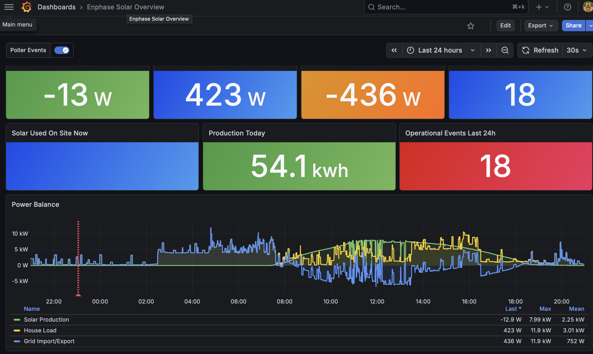

# Enphase Poller

A simple Python poller that collects solar production, consumption, and power quality data from a local Enphase Envoy (IQ Gateway) and stores it in PostgreSQL for Grafana dashboards. Includes a REST API for querying metrics.



## Features

- Polls 4 Envoy local API endpoints at different cadences (30s to 5min)
- Stores full production, consumption, meter, and per-inverter data
- Deduplicates using Envoy-provided timestamps
- Detects polling gaps and estimates missed energy using cumulative counters
- REST API (FastAPI) for live readings, daily summaries, and flexible historical queries
- Swagger docs at `/docs`
- Designed for long-term, consistent history

## Requirements

- Enphase Envoy IQ Gateway with firmware D7+ (JWT auth)
- PostgreSQL database
- Python 3.12+

## Quick Start

### Docker Compose (recommended)

```bash
cp .env.example .env
# Edit .env with your token

docker compose up --build -d
```

The poller starts polling the Envoy and serves the API on port 8000.

### Manual

```bash
cp .env.example .env
# Edit .env with your token and database URL

pip install -r requirements.txt
python -m poller.main
```

## Configuration

| Variable | Default | Description |
|----------|---------|-------------|
| `ENVOY_HOST` | `envoy.local` | Envoy hostname or IP |
| `ENPHASE_TOKEN` | (required) | JWT access token |
| `DATABASE_URL` | (required) | PostgreSQL connection string |
| `POLL_INTERVAL` | `30` | Seconds between production/meter polls |
| `METER_REPORT_POLL_INTERVAL` | `60` | Seconds between cumulative counter polls |
| `INVERTER_POLL_INTERVAL` | `300` | Seconds between per-inverter polls |
| `ENABLE_CHANNEL_READINGS` | `false` | Store per-phase meter channel data (~19M extra rows/year) |
| `API_PORT` | `8000` | REST API listening port |
| `API_KEY` | (required) | API key for authenticating REST requests |

## Getting a Token

See [how_to_create_token.md](how_to_create_token.md) for instructions on generating an Envoy access token.

## REST API

All endpoints require the `X-API-Key` header. Swagger docs are available at `/docs`.

| Endpoint | Description |
|----------|-------------|
| `GET /api/live` | Current power: production, consumption, grid (W) |
| `GET /api/today` | Today's energy totals (kWh), self-consumption % |
| `GET /api/week` | Last 7 days daily production & consumption |
| `GET /api/energy` | Flexible historical query with filtering & aggregation |
| `GET /api/health` | Poller events from last 24h |
| `GET /api/summary` | All of the above combined |

### `/api/energy` examples

```bash
# Day with max production this year
curl -H "X-API-Key: $API_KEY" \
  "localhost:8000/api/energy?metric=production&from=2026-01-01&order_by=value&order=desc&limit=1"

# Last week consumption day by day
curl -H "X-API-Key: $API_KEY" \
  "localhost:8000/api/energy?metric=consumption&from=2026-04-07&group_by=day"

# Hourly production yesterday
curl -H "X-API-Key: $API_KEY" \
  "localhost:8000/api/energy?metric=production&from=2026-04-13&to=2026-04-14&group_by=hour"
```

## Grafana Dashboard

Import `grafana/dashboard.json` into Grafana. The dashboard includes:

- Live stat panels (production, consumption, grid export, inverters)
- Power balance time-series chart
- Hourly energy bar chart with day/night shading
- Self-consumption percentage and daily production
- Poller events table and annotations
- Operational events counter

## Docker

```bash
docker build -t enphase-poller .
docker run --env-file .env enphase-poller
```

## Agent Skill

This repo includes an [Agent Skill](https://agentskills.io/) that lets AI coding agents answer natural language questions about your solar data (e.g. "how much did I produce today?", "best production day this month?").

### Install in OpenClaw

Copy the skill directly into your OpenClaw skills directory (no need to clone the full repo):

```bash
mkdir -p ~/.openclaw/skills/enphase-poller
curl -sL https://raw.githubusercontent.com/bixentemal/enphase-poller/main/.claude/skills/enphase-poller/SKILL.md \
  -o ~/.openclaw/skills/enphase-poller/SKILL.md
```

Then set the required environment variables:

```bash
export ENPHASE_POLLER_REST_API=http://<poller-ip>:8000
export ENPHASE_POLLER_REST_API_KEY=<your-api-key>
```

The skill is also compatible with Claude Code, Cursor, GitHub Copilot, Gemini CLI, and [other agents supporting the Agent Skills format](https://agentskills.io/).

## Database Schema

The schema is automatically created on startup. See [schema.sql](schema.sql) for the full definition.

### Tables

| Table | Source | Cadence |
|-------|--------|---------|
| `production_overview` | `/production.json` | 30s |
| `meter_readings` | `/ivp/meters/readings` | 30s |
| `meter_reading_channels` | `/ivp/meters/readings` (per-phase) | 30s |
| `meter_reports` | `/ivp/meters/reports` | 60s |
| `inverter_readings` | `/api/v1/production/inverters` | 300s |
| `poller_events` | internal | on error/gap |
